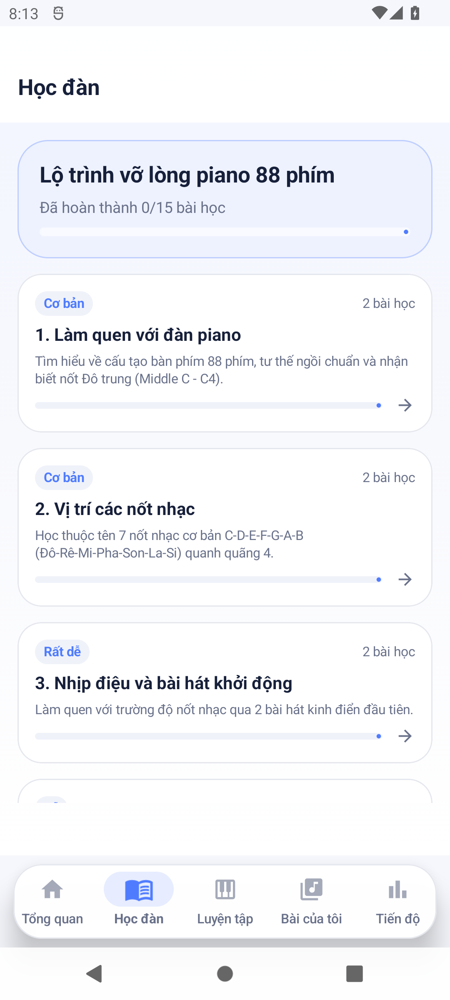
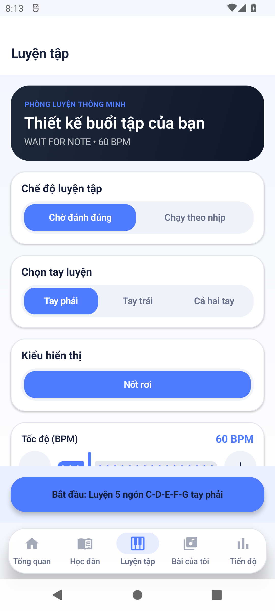
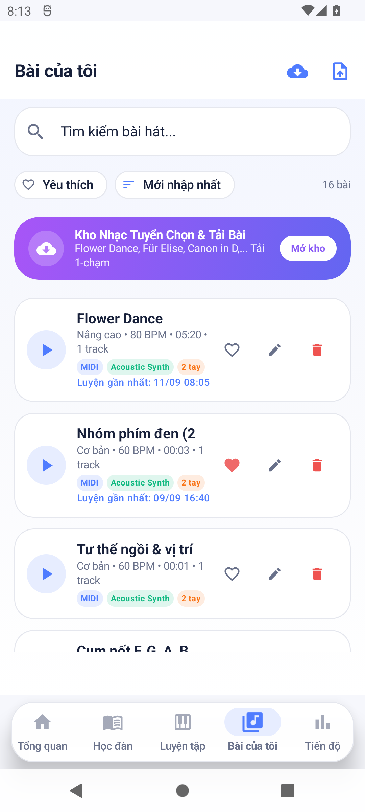
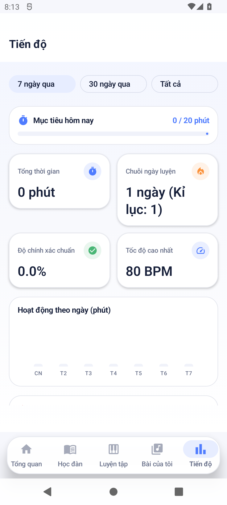
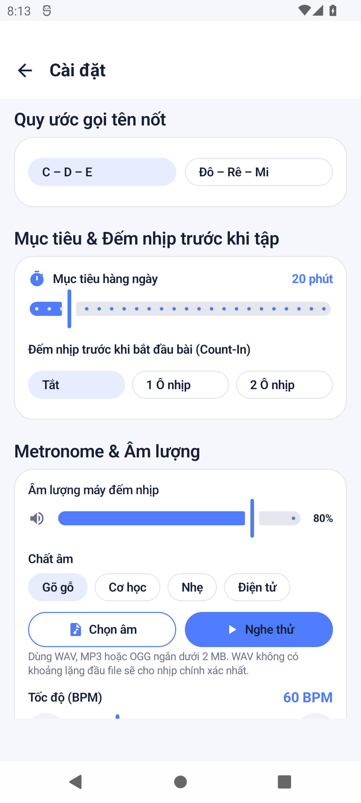
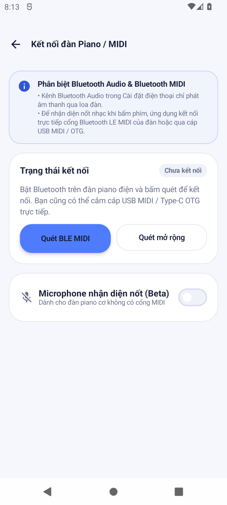
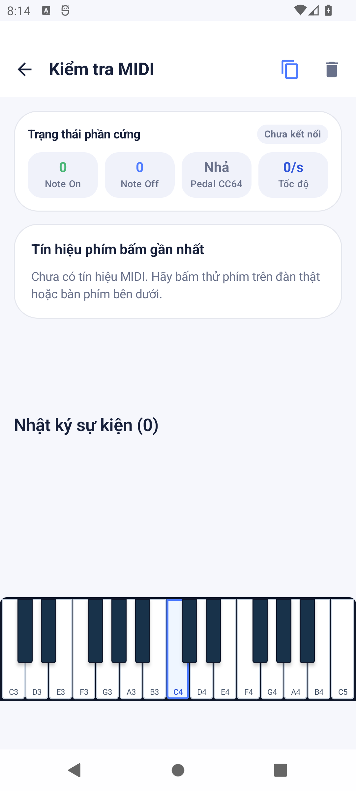
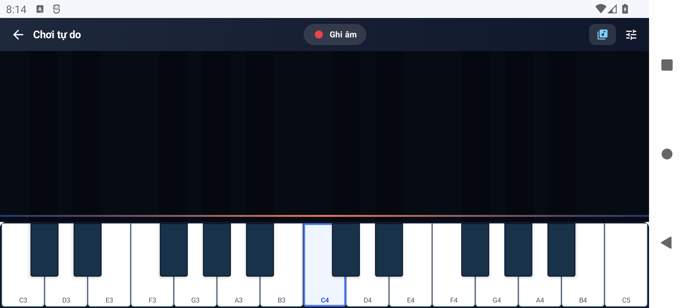

# 🎹 StudyPiano

Ứng dụng học và luyện đàn piano native dành cho Android, xây dựng bằng Kotlin và Jetpack Compose. StudyPiano hỗ trợ đàn MIDI qua USB/Bluetooth, luyện tập theo bài, chơi tự do, theo dõi tiến độ và hoạt động hoàn toàn offline.

## 📲 Tải ứng dụng

[](https://github.com/VietCodeBug/StudyPiano/raw/refs/heads/main/releases/PianoTrainer-debug.apk)

> Bản hiện tại là debug APK. Nếu Android chặn cài đặt, hãy cho phép **Cài ứng dụng không rõ nguồn gốc** cho trình duyệt hoặc trình quản lý tệp đang dùng.

## ✨ Tính năng nổi bật

- Kết nối đàn MIDI qua USB hoặc Bluetooth và kiểm tra tín hiệu theo thời gian thực.
- Bàn phím cảm ứng đa điểm, hỗ trợ vuốt qua nhiều phím và xử lý note-off an toàn.
- Chế độ chơi tự do với hiệu ứng nốt nhạc trực quan.
- Luyện tập theo MIDI, hiển thị nốt rơi, timeline và đánh giá kết quả.
- Kho bài cá nhân, bài mẫu offline và tải bài MIDI từ đường dẫn trực tiếp.
- Máy đếm nhịp với nhiều chất âm, chỉnh âm lượng và nhập click riêng (`.wav`, `.mp3`, `.ogg`).
- Lộ trình học, thống kê thời gian luyện tập và tiến độ cá nhân.

## 🖼️ Giao diện ứng dụng

<table>
  <tr>
    <td align="center"><br><b>Tổng quan</b></td>
    <td align="center"><br><b>Học đàn</b></td>
    <td align="center"><br><b>Luyện tập</b></td>
  </tr>
  <tr>
    <td align="center"><br><b>Bài của tôi</b></td>
    <td align="center"><br><b>Tiến độ</b></td>
    <td align="center"><br><b>Cài đặt</b></td>
  </tr>
  <tr>
    <td align="center"><br><b>Kết nối MIDI</b></td>
    <td align="center"><br><b>Chẩn đoán MIDI</b></td>
    <td align="center"></td>
  </tr>
</table>

### Chế độ chơi tự do

<p align="center">
  
</p>

## 🛠️ Công nghệ

- Kotlin, Coroutines và Flow
- Jetpack Compose + Material 3
- Room Database
- Android MIDI API
- Custom audio engine và MIDI parser
- MVVM/Clean Architecture

## 🚀 Build từ mã nguồn

Yêu cầu JDK 17 và Android SDK Platform 35. Tạo `local.properties` với đường dẫn Android SDK:

```properties
sdk.dir=C\:\\Users\\<YourUsername>\\AppData\\Local\\Android\\Sdk
```

Build APK và chạy unit test:

```powershell
.\gradlew.bat assembleDebug
.\gradlew.bat testDebugUnitTest
```

APK sau khi build nằm tại:

```text
app/build/outputs/apk/debug/app-debug.apk
```

## 🔒 Quyền riêng tư

Ứng dụng hoạt động offline, không yêu cầu tài khoản, Firebase hay Google API key. Quyền truy cập tệp chỉ được dùng khi người dùng chủ động chọn bài nhạc hoặc âm thanh metronome.

---

Phát triển bởi [VietCodeBug](https://github.com/VietCodeBug).
